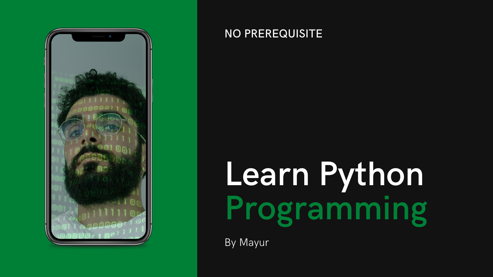

## Learning Python Programming

The objective of the repository is to learn python in efficient way by practicing and understanding the key aspects of python required to get started in python developement and for machine learning.

- Data Structure
- String and Text
- Numbers and Datetime 
- File Handling and IO operations
- Iterators and Generators
- Data Encoding and Processing
- Functions

To be continued.
